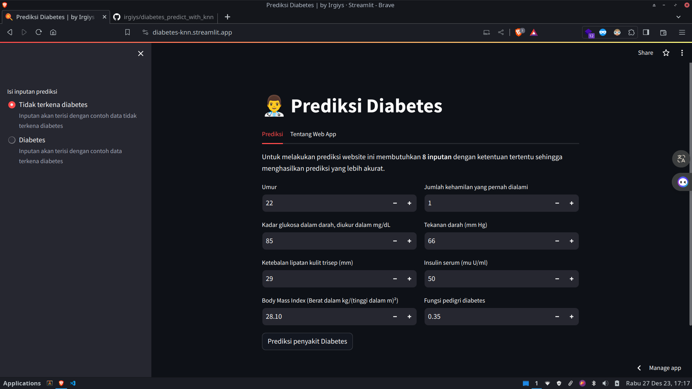

# Laporan Proyek Machine Learning

### Nama : Irgiyansyah

### Nim : 211351068

### Kelas : Malam B

## Domain Proyek

Web App ini sebaiknya digunakan bersama dengan seorang profesional medis agar variabel yang dimasukkan tidak salah atau sembarangan. Web App ini dibuat untuk mempermudah pengguna dalam memprediksi apakah pasien memiliki diabetes atau tidak berdasarkan hasil outputnya. Namun, jika Anda bukan seorang profesional, disarankan untuk berkonsultasi langsung dengan ahli medis.

## Business Understanding

Web App ini memungkinkan profesional medis untuk bekerja lebih efisien dan akurat dalam menangani pasien dengan diabetes. Ini membantu dalam mempercepat proses diagnosis dan pengobatan, memungkinkan lebih banyak pasien untuk menerima perhatian yang tepat dari dokter.

### Problem Statement

Peningkatan jumlah kasus diabetes disebabkan oleh pola hidup yang tidak sehat dalam masyarakat modern, yang menyebabkan peningkatan beban kerja bagi para profesional medis dalam menangani pasien.

### Goals

Membantu dokter dan ahli kesehatan dalam menentukan langkah-langkah pengobatan yang tepat bagi pasien yang menderita atau tidak menderita diabetes melalui hasil yang dihasilkan oleh Web App. Hal ini bertujuan untuk memfasilitasi proses diagnosis dan pengobatan dengan lebih efisien, membantu dalam menyediakan perawatan yang lebih baik bagi pasien.

### Solution Statements

-   Memproses data medis dengan cepat dan akurat untuk memprediksi apakah seorang pasien menderita diabetes atau tidak.
-   Memberikan hasil yang jelas dan mudah dipahami kepada dokter atau ahli kesehatan untuk membantu dalam menentukan langkah-langkah pengobatan berikutnya.
-   Meningkatkan efisiensi dalam proses diagnosis sehingga dokter dapat memberikan perawatan yang lebih tepat waktu kepada pasien yang membutuhkan.

## Data Understanding

Dataset ini berasal dari National Institute of Diabetes and Digestive and Kidney Diseases. Tujuan dari dataset ini adalah untuk memprediksi secara diagnostik apakah seorang pasien menderita diabetes, berdasarkan pengukuran diagnostik tertentu yang ada dalam dataset. Beberapa batasan diterapkan dalam pemilihan contoh-contoh ini dari database yang lebih besar. Secara khusus, semua pasien di sini adalah perempuan yang berusia minimal 21 tahun dan memiliki keturunan Indian Pima.  
Dataset = [Predict diabetes](https://www.kaggle.com/datasets/whenamancodes/predict-diabities)

### Variabel-variabel pada Diabetes Prediction adalah sebagai berikut:

-   **Pregnancies**

    -   Jumlah kehamilan yang pernah dialami
    -   min (0), max (17)
    -   type(int64)

-   **Glucose**

    -   Kadar glukosa dalam darah, diukur dalam mg/dL
    -   min (0), max (199)
    -   type(int64)

-   **BloodPressure**

    -   Tekanan darah (mm Hg)
    -   min (0), max (122)
    -   type(int64)

-   **SkinThickness**

    -   Ketebalan lipatan kulit trisep (mm)
    -   min (0), max (99)
    -   type(int64)

-   **Insulin**

    -   Insulin serum (mu U/ml)
    -   min (0), max (846)
    -   type(int64)

-   **BMI**

    -   Body Mass Index (Berat dalam kg/(tinggi dalam m)²)
    -   min (0), max (67.1)
    -   type(float64)

-   **DiabetesPedigreeFunction**

    -   Fungsi pedigri diabetes
    -   min (0.078), max (2.42)
    -   type(float64)

-   **Age** :

    -   Umur pasien dalam tahun
    -   min (21), max (81)
    -   type(int64)

-   **Outcome** :

    -   Kelas variable penentu diabetes
    -   min (0), max (1)
    -   type(int64)

## Data Prepartaion

Pada tahap ini saya melakukan data preparataion dengan metode Exploratory Data Analysis (EDA).

### Persiapan bekerja dengan Kaggle

Karena saya menggunakan Google Colaboratory, pertama saya akan mengunggah file `kaggle.json` yang dimana ini akan digunakan untuk mengunduh datasets dari kaggle.

```python
from google.colab import files
files.upload()
```

Setelah file `kaggle.json` diunggah, saya akan membuat direktori `~/.kaggle` dan menyalin file `kaggle.json` ke direktori tersebut lalu mengubah file permission nya menjadi 600

```python
!mkdir -p ~/.kaggle
!cp kaggle.json ~/.kaggle/
!chmod 600 ~/.kaggle/kaggle.json
!ls ~/.kaggle
```

### Unduh datasets

Setelah persiapan Kaggle selesai, saya mengunduhh datasets dengan perintah :

```python
!kaggle datasets download -d whenamancodes/predict-diabities
```

### Extract file

Untuk mendapatkan file datasets, saya mengekstrak file `zip` hasil unduhan diatas dan menyimpannya kedalam direktori `predict-diabities`.

```python
!mkdir predict-diabities
!unzip predict-diabities.zip -d predict-diabities
!ls predict-diabities
```

Setelah didapatkan file `diabetes.csv`, kita siap menggunakan datasetsnya.

### Import library yang diperlukan

Selanjutnya saya mengimport library yang akan digunakan.

```python
# library yang umum digunakan untuk manipulasi dan analisis data.
import pandas as pd
import numpy as np

# library untuk visualisasi data dan pemetaan.
import matplotlib.pyplot as plt
import seaborn as sns
import plotly.graph_objects as go
from mlxtend.plotting import plot_decision_regions

# library yang digunakan untuk pembelajaran mesin, termasuk model, pemrosesan data, dan pengukuran kinerja model.
from sklearn.model_selection import train_test_split
from sklearn.neighbors import KNeighborsClassifier
from sklearn.preprocessing import StandardScaler
from sklearn import neighbors
from sklearn import metrics

# libary untuk save model
import pickle

# untuk menonaktifkan warning abaikan (ignore)
import warnings; warnings.filterwarnings("ignore"); warnings.simplefilter('ignore')
```

### Inisialisasi DataFrame

Saya menginisialisi data frame dengan perintah berikut :

```python
df = pd.read_csv('/content/predict-diabities/diabetes.csv')
```

Kemudian saya menampilkan 5 sampel data teratas.

```python
df.head()
```

Untuk melihat tipe data pada setiap kolom dapat menggunakan perintah berikut :

```python
df.info()
```

### Data Cleansing

Pada tahap ini saya akan membersikan data yang tidak diperlukan ataupun yang akan mengganggu pada tahap berikutnya. Pertama saya akan menghitung jumlah nilai null (NaN) dalam setiap kolom

```python
df.isnull().sum().sort_values(ascending=False)
```

Dan outputnya adalah 0 semua artinya tidak ada data yang null

Selanjutnya saya akan memeriksa data duplikat

```python
df.duplicated().sum()
```

Dan outpunya adalah 0 artinya tidak ada data yang duplikat, baik setelah proses pengecekan data null dan data duplikat serta kita mendapati semua feature berptipe data numerik kita dapat melanjutkan ke proses berikutnya.

## Visualisasi

Pertama kita lihat korelasi tertinggi diantara feature dengan label dann Glucose memiliki korelasi paling tinggi yaitu 0.47

```python
corr_matrix = df.corr()["Outcome"].sort_values(ascending=False)
sns.heatmap(corr_matrix.to_frame(),cmap="coolwarm", annot=True)
```


Selanjutnya saya akan melihat boxplot dari masing-masing feature

```python
parameters = list(df.columns.drop(["Outcome"])) # Hapus label

plt.figure(figsize=(15, 10))

for i, parameter in enumerate(parameters):
    plt.subplot(3, 2, i % 6 + 1)
    sns.boxplot(x=df[parameter])
    plt.title(parameter)

    if i % 3 == 2 or i == len(parameters) - 1:
        plt.tight_layout()

plt.show()
```


Selanjutnya saya akan membuat fungsi untuk menampilkan historgram untuk melihat faktor-faktor pada diabetes

```python
def create_hist(outcome_label_1, outcome_label2, title):
    trace2 = go.Histogram(
        x=outcome_label_1,
        opacity=0.75,
        name='Diabetes',
        marker=dict(color='navy')
    )

    trace1 = go.Histogram(
        x=outcome_label2,
        opacity=0.75,
        name='Non-diabetes',
        marker=dict(color='salmon')
    )

    layout = go.Layout(
        barmode='overlay',
        title_text=f'{title} Histogram by Outcome',
        xaxis=dict(title=f'{title}'),
        yaxis=dict(title='Frequency')
    )

    data = [trace1, trace2]
    fig = go.Figure(data=data, layout=layout)
    return fig
```

Nah pertama saya akan melihat faktor glukosa pada diabetes

```python
Glucose_outcome_1 = df[df['Outcome'] == 1]['Glucose']
Glucose_outcome_0 = df[df['Outcome'] == 0]['Glucose']

create_hist(Glucose_outcome_1, Glucose_outcome_0, "Glucose")
```


Dari histogram yang diatas dapat kita artikan semakin tinggi glukosa semakin besar kemungkinan diabetes

Selanjutya faktor BMI (Body Mass Index) pada diabetes

```python
BMI_outcome_1 = df[df['Outcome'] == 1]['BMI']
BMI_outcome_0 = df[df['Outcome'] == 0]['BMI']

create_hist(BMI_outcome_1, BMI_outcome_0, "BMI")
```


Dari histogram diatas dapat kita artikan bahwa sebagian besar orang yang memiliki BMI kurang dari 25 tidak mengalami diabetes. Hanya sedikit yang mengalami diabetes.

Selanjutya faktor Umur pada diabetes

```python
Age_outcome_1 = df[df['Outcome'] == 1]['Age']
Age_outcome_0 = df[df['Outcome'] == 0]['Age']

create_hist(Age_outcome_1, Age_outcome_0, "Age")
```


Berdasarkan histogram diatas dapat kita simpulkan bahwa risiko menderita diabetes meningkat seiring dengan bertambahnya usia.

Selanjutnya faktor jumlah melahirkan pada diabetes

```python
Pregnancies_outcome_1 = df[df['Outcome'] == 1]['Pregnancies']
Pregnancies_outcome_0 = df[df['Outcome'] == 0]['Pregnancies']

create_hist(Pregnancies_outcome_1, Pregnancies_outcome_0, "Pregnancies")
```


Histogram ini diatas menunjukan bahwa sebagian besar Pregnancies tidak mengalami diabetes. Artinya faktor ini tidak terlalu berpengaruh pada diabetes.

Dan yang terakhir diabetes pedigree function pada diabetes


Histogram di atas menunjukkan distribusi fungsi pewarisan diabetes berdasarkan hasil. Mayoritas orang yang memiliki sejarah keluarga diabetes memiliki fungsi pewarisan diabetes yang tinggi. Hal ini menunjukkan bahwa genetika memainkan peran penting dalam perkembangan diabetes.

## Modeling

Pada tahap ini saya akan membuat feature dari semua kolom kecuali kolom `Outcome` yang dimana akan dijadikan sebagai label dengan perintah berikut :

```python
X = df.drop('Outcome',axis=1).values
Y = df[["Outcome"]]
```

Selanjutnya membagi dataset menjadi dua subset, subset untuk training (training set) dan subset untuk testing (test set), sebanyak 30% akan dijadikan sebagai test set, sedangkan sisanya kedalam train set.

```python
X_train, X_test, y_train, y_test = train_test_split(X,Y,test_size=0.3, random_state=20)
```

Kemudian sebelum membuat model, kita scaling data training dan testing

```python
scaler = StandardScaler()
X_train = scaler.fit_transform(X_train)
X_test = scaler.transform(X_test)
```

Setelah data disiapkan selanjutnya saya akan mencari nilai n_neighbors terbaik pada model ini dengan perintah berikut

```python
X_axis = list(range(2, 15))
acc_test = pd.Series()
acc_train = pd.Series()

for i in range(2, 15):
    knn_model_test = KNeighborsClassifier(n_neighbors=i)
    knn_model_test.fit(X_test, y_test)
    acc_test = acc_test.append(pd.Series(knn_model_test.score(X_test, y_test)))

    knn_model_train = KNeighborsClassifier(n_neighbors=i)
    knn_model_train.fit(X_train, y_train)
    acc_train = acc_train.append(pd.Series(knn_model_train.score(X_train, y_train)))

x = range(2, 15)

plt.figure(figsize=(10, 6))

plt.plot(X_axis, acc_test, label='Test Data')
plt.plot(X_axis, acc_train, label='Train Data')

plt.xticks(x)
plt.title("Mencari nilai terbaik n_neighbors")
plt.xlabel("n_neighbors")
plt.ylabel("Accuracy")
plt.grid()
plt.legend()
plt.show()
```


Dapat kita lihat score tertinggi berada pada n3 dan kita akan menggunakan 3 untuk model ini untuk akurasi yang lebih baik

```python
knn_model = KNeighborsClassifier(n_neighbors=3)
knn_model.fit(X_train, y_train)

print("Akurasi model KNN =", knn_model.score(X_test,y_test))
```

Dan akurasi yang didapatkan yaitu 0.74 atau 74% yang dimana cukup untuk model prediksi

Selanjutnya saya akan mencoba prediksi dengan sampel data teratas

```python
prediction = knn_model.predict(X_test)
input_data = np.array([[6,148,72,35,0,33.6,0.627,50]]) # 1

prediction = knn_model.predict(input_data)
if(prediction[0] == 1) :
  print("Diabetes")
else:
  print("Tidak diabetes")
```

Hasilnya adalah "Diabetes" yang berarti prediksi berhasil.

### Visualisasi hasil algoritma

Selanjutnya kita akan melihat visualisasi hasil dari algoritma KNN dengan perintah berikut

```python
# Fungsi untuk menampilkan plot decision boundary
# Disini kita menggunakan Glucose dikarenakan memiliki korelasi tertinggi sedangkan BloodPressure terendah
def knn_comparison(data, k, ax):
    x = data[['Glucose','BloodPressure']].values
    y = data['Outcome'].astype(int).values
    clf = neighbors.KNeighborsClassifier(n_neighbors=k)
    clf.fit(x, y)

    plot_decision_regions(x, y, clf=clf, legend=2, ax=ax)
    ax.set_xlabel('Glucose')
    ax.set_ylabel('Blood Pressure')
    ax.set_title('Knn with K=' + str(k))
fig, axs = plt.subplots(1, 2, figsize=(10, 5))

# nilai n_neigbors untuk pengetesan kita gunakan 3 dan 10
ks = [3, 10]
for i, ax in enumerate(axs.flatten()):
    knn_comparison(df, ks[i], ax)

plt.tight_layout()
plt.show()
```


Dapat kita lihat semakin tinggi Glocose semakin besar kemungkinan terkena diabetes, sedangkan blood pressure tidak begitu berpengaruh

### Import model

```python
filename = 'diabetes_model.sav'
pickle.dump(knn_model, open(filename, 'wb'))
```

## Evaluation

Matriks evaluasi yang saya gunakan di sini adalah confusion matrix, yang sangat relevan untuk kasus prediksi seperti yang sedang dibahas. Dengan menggunakan confusion matrix, kita dapat membandingkan nilai-nilai aktual dengan nilai-nilai yang diprediksi oleh model. Hal ini memungkinkan kita untuk melihat jumlah hasil prediksi saat model memperkirakan keberadaan diabetes yang sesuai dengan nilai aktual diabetes, sekaligus juga memungkinkan kita untuk melihat hasil ketika model memprediksi diabetes sedangkan kenyataannya data tersebut tidak mengindikasikan adanya diabetes.

```python
y_pred = knn_model.predict(X_test)

cnf_matrix = metrics.confusion_matrix(y_test, y_pred)

p = sns.heatmap(pd.DataFrame(cnf_matrix), annot=True, cmap="YlGnBu" ,fmt='g')
plt.title('Confusion matrix', y=1.1)
plt.ylabel('Actual label')
plt.xlabel('Predicted label')
```


Berdasarkan confusion matrix diatas, dapat disimpulkan bahwa model tersebut memprediksi label dengan benar untuk 120 data positif dan 60 data negatif. Namun, model tersebut juga membuat kesalahan dalam memprediksi label untuk 28 data positif (FP) dan 30 data negatif (FN).

## Deployment

Berikut link web app [Diabtes Prediction](https://diabetes-knn.streamlit.app/)


